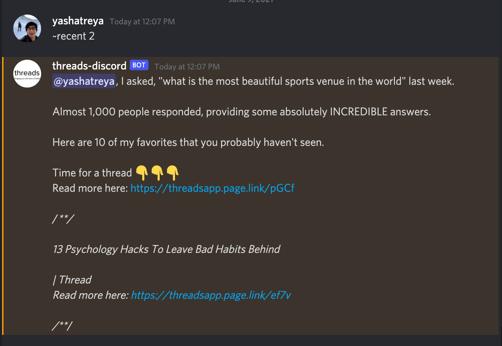
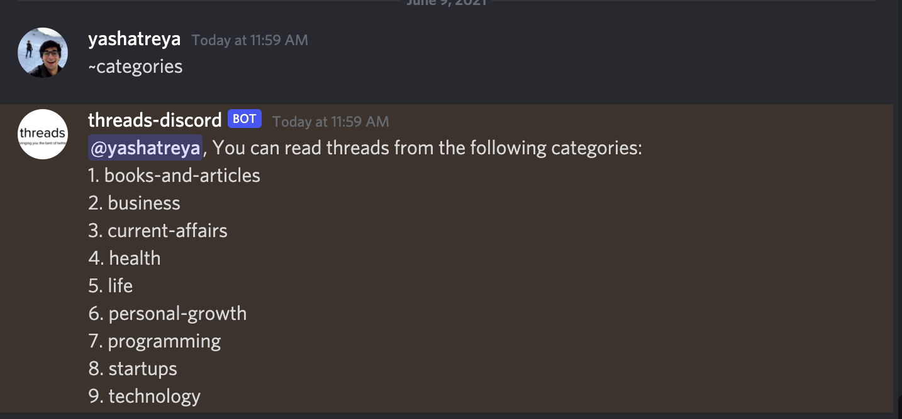
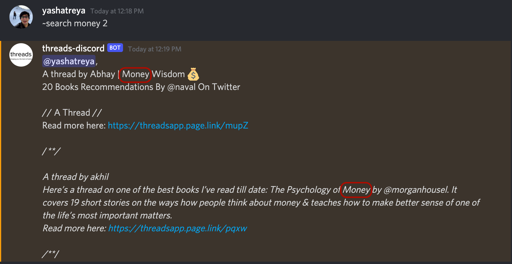

# threads-discord-bot

Discord bot for the incredible [threads_reader app](https://threads-web.vercel.app)

## What is threads_reader?

Here's a [preview](https://www.youtube.com/watch?v=-Wto4p13KZg)

## Installation

Add this bot to your discord server by click [here](https://discord.com/api/oauth2/authorize?client_id=850254139233271838&permissions=26624&scope=bot)

## Bot Commands

All commands should begin with "~", which is the prefix for the bot

- recent

    Gives you the most recent threads the bot has collected from twitter

    ```sh
    # num: integer - number of threads you wish to retrieve
    ~recent num
    ```
    
    Reply:
    
    

- categories

    Lists the categories available to read from

    ```sh
    ~categories
    ```
    Reply:

    

- category

    Get threads from a paritcular category

    ```sh
    # num: integer - number of threads you wish to retrieve
    ~category category num
    # category: one of - 
    # 1. books-and-articles
    # 2. business
    # 3. current-affairs
    # 4. health
    # 5. life
    # 6. personal-growth
    # 7. programming
    # 8. startups
    # 9. technology
    ```

    Reply:

    

- search

    Search for a particular thread

    ```sh
    # num: integer - number of threads you wish to retrieve
    # query: string - your search query
    ~search query num
    ```

    Reply:

    
